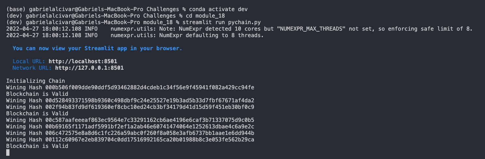

# Module 18

## Instructions
Your task is to build a blockchain-based ledger system, complete with a user-friendly web interface. This ledger should allow partner banks to conduct financial transactions (that is, to transfer money between senders and receivers) and to verify the integrity of the data in the ledger.

You’ll make the following updates to the provided Python file for this Challenge, which already contains the basic PyChain ledger structure that you created throughout the module:

- Create a new data class named Record. This class will serve as the blueprint for the financial transaction records that the blocks of the ledger will store.

- Change the existing Block data class by replacing the generic data attribute with a record attribute that’s of type Record.

- Create additional user input areas in the Streamlit application. These input areas should collect the relevant information for each financial record that you’ll store in the PyChain ledger.

Test your complete PyChain ledger.

You’ll then upload the Python file for this Challenge to your GitHub repository. Make sure to update the README.md file to include an explanation of the Steamlit application, a screenshot or video of your deployed Streamlit application, and any other information that’s needed to interact with your project.

---
## Installation Guide
1. Clone this project using git with the following command: `git clone git@github.com:galcivar/module_18.git`
2. Install Python you should follow this instructions depending on you OS: https://realpython.com/installing-python/

---
## Usage
`streamlit run pychain.py`

---
## Explanation
Once the application is run you need to input the sender address (string), the receiver address (string) and the amount (float). Then you can add block by clicking on **Add Block**.

On the left panel you can select the hashing difficulty.

And with the **Block Inspector** you can review each block of the blockchain.

In the Main View you can see the **Ledger** where one can validate the Ledger (*True* if valid *False* if not valid).

---
## Screenshots
### Adding and Validating to the Blockchain
**TODO**

### Validated Blockchain

---
## Contributors
Gabriel Alcivar
[Email](mailto:galcivar@galgomedia.com) - [LinkedIn](https://www.linkedin.com/in/gabriel-alcivar-aa83a710b/) - [GitHub](https://github.com/galcivar/)

---
## MIT License

Copyright (c) [2022] [Gabriel Alcivar]

Permission is hereby granted, free of charge, to any person obtaining a copy
of this software and associated documentation files (the "Software"), to deal
in the Software without restriction, including without limitation the rights
to use, copy, modify, merge, publish, distribute, sublicense, and/or sell
copies of the Software, and to permit persons to whom the Software is
furnished to do so, subject to the following conditions:

The above copyright notice and this permission notice shall be included in all
copies or substantial portions of the Software.

THE SOFTWARE IS PROVIDED "AS IS", WITHOUT WARRANTY OF ANY KIND, EXPRESS OR
IMPLIED, INCLUDING BUT NOT LIMITED TO THE WARRANTIES OF MERCHANTABILITY,
FITNESS FOR A PARTICULAR PURPOSE AND NONINFRINGEMENT. IN NO EVENT SHALL THE
AUTHORS OR COPYRIGHT HOLDERS BE LIABLE FOR ANY CLAIM, DAMAGES OR OTHER
LIABILITY, WHETHER IN AN ACTION OF CONTRACT, TORT OR OTHERWISE, ARISING FROM,
OUT OF OR IN CONNECTION WITH THE SOFTWARE OR THE USE OR OTHER DEALINGS IN THE
SOFTWARE.
